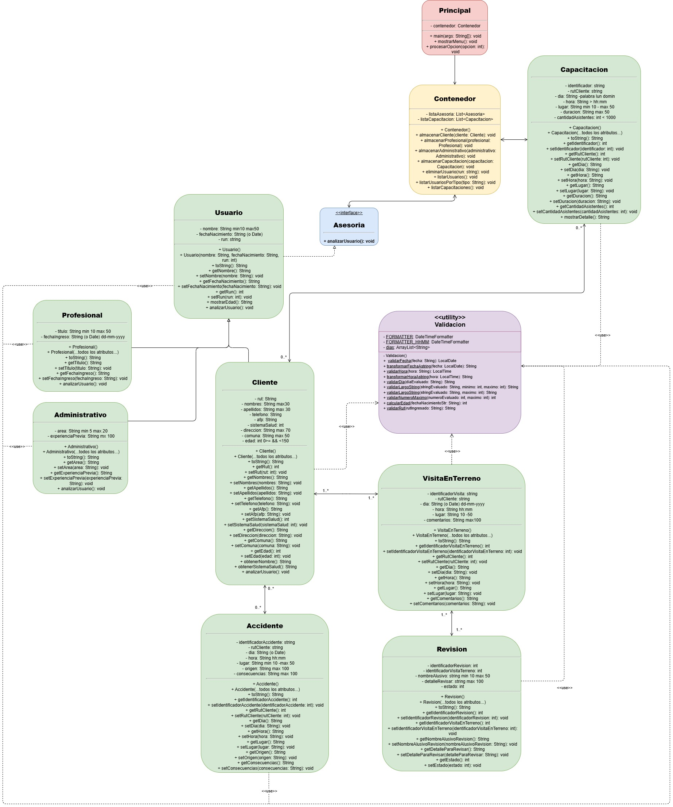

# 🛡️ Sistema de Gestión de Prevención de Riesgos Laborales

## 🎯 Contexto del Problema

En los últimos años, han aumentado significativamente los índices de accidentabilidad en empresas industriales, mineras y de construcción. Muchas de estas empresas no contratan asesorías especializadas debido al alto costo, lo que las expone a multas, gastos por accidentes, baja productividad y posibles demandas laborales.

Las empresas que sí contratan servicios de prevención enfrentan problemas de gestión: falta de control sobre actividades, mala planificación de visitas, ausencia de registros digitales y dificultad para coordinar con profesionales en terreno. Además, muchas actividades se registran en carpetas físicas, lo que dificulta el seguimiento y la generación de reportes.

## 💡 Planteamiento de la Solución

Se desarrolló una **aplicación en Java orientada a objetos** que permite a una empresa de asesorías en prevención de riesgos gestionar de forma eficiente sus procesos, cumplir con la normativa legal y mejorar la seguridad y productividad de sus clientes.

El sistema centraliza la información de clientes, profesionales, administrativos, capacitaciones, visitas en terreno, revisiones y accidentes, facilitando la planificación, el control y la toma de decisiones.

---

## 🧱 Arquitectura del Sistema

### 🧩 Diagrama de Clases

A continuación se muestra el diagrama UML del sistema:



> El diagrama muestra las relaciones de herencia, implementación y asociación entre las principales clases del sistema.

### 📦 Estructura de Clases

| Clase               | Descripción                                                                 |
|---------------------|-----------------------------------------------------------------------------|
| `Usuario`           | Clase base abstracta heredada por Cliente, Profesional y Administrativo.    |
| `Cliente`           | Representa a un cliente con datos personales, sistema de salud, AFP, etc.   |
| `Profesional`       | Profesional en prevención de riesgos con título y fecha de ingreso.         |
| `Administrativo`    | Personal administrativo con área de trabajo y experiencia previa.           |
| `Capacitacion`      | Gestiona capacitaciones: día, hora, lugar, duración y asistentes.           |
| `VisitaEnTerreno`   | Registra visitas en terreno con comentarios y validaciones.                 |
| `Revision`          | Detalla observaciones realizadas durante una visita.                        |
| `Accidente`         | Documenta accidentes ocurridos en empresas clientes.                        |
| `Contenedor`        | Almacena y gestiona usuarios y capacitaciones.                              |
| `Principal`         | Clase principal con menú interactivo para el usuario.                       |
| `Asesoria`          | Interfaz con el método `analizarUsuario()`.                                 |
| `Validacion`        | Clase utilitaria para validar RUT, fechas, horas, formatos, etc.            |
| `BaseDatos`         | Carga datos de prueba para facilitar pruebas y demostraciones.              |

### ✅ Características Principales

- **Herencia y polimorfismo**: Uso de `Usuario` como clase base.
- **Encapsulamiento**: Atributos privados con getters y setters.
- **Validaciones robustas**: Formato de RUT, fechas, horas, rangos, longitudes.
- **Métodos especializados**:
  - `analizarUsuario()` en cada tipo de usuario.
  - `mostrarDetalle()` en capacitaciones.
  - `mostrarEdad()` en usuarios.
- **Gestión centralizada**: Clase `Contenedor` para almacenar y listar información.
- **Interfaz de usuario en consola**: Menú interactivo con 9 opciones.

---

## 🖥️ Cómo Ejecutar el Proyecto

### 1. Compilar el proyecto

Este paso convierte el código fuente (.java) en bytecode (.class) para que pueda ejecutarse.

```bash
javac -d bin src/prevencionDeRiesgos/*.java
```
### 2. Ejecutar la clase principal

Inicia el programa desde la clase Principal.

```bash
java -cp bin prevencionDeRiesgos.Principal
```

### 3. Usar el menú interactivo

Al ejecutar el programa, se mostrará un menú con las siguientes opciones:

1. Almacenar cliente
2. Almacenar profesional
3. Almacenar administrativo
4. Almacenar capacitación
5. Eliminar usuario
6. Listar usuarios
7. Listar usuarios por tipo
8. Listar capacitaciones
9. Salir del programa

El sistema permite:

Ingresar datos con validaciones (RUT, fechas, formatos, rangos).
Eliminar usuarios por RUT.
Listar toda la información almacenada.
Navegar de forma intuitiva hasta que se elija la opción 9 para salir.

## 📚 Documentación Javadoc

Genera la documentación oficial del proyecto con el siguiente comando:

```bash
javadoc -d docs -author -version src/prevencionDeRiesgos/*.java
```
Una vez generado, abre el archivo principal de la documentación en tu navegador:

```docs/index.html```

La documentación incluye:

Descripción de todas las clases y métodos.
Información de autores y versiones.
Comentarios detallados de cada componente del sistema.

## 👥 Autores

- Luis Guevara
- Yerko Osorio
- Jhoseph Quiroga
- Norma Armijo

## 🌐 Repositorio

Este proyecto fue desarrollado como parte de la evaluación final del curso de Fundamentos de Java.

> 🔗 [Enlace al repositorio en GitHub](https://github.com/yerkoppp/EvaluacionFinalMod2.git)